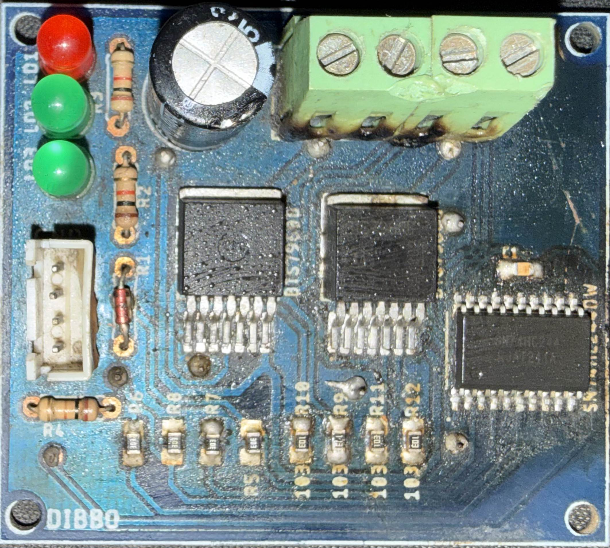
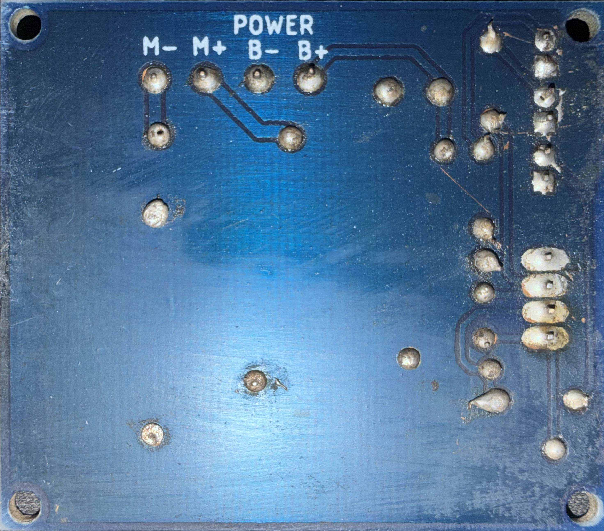
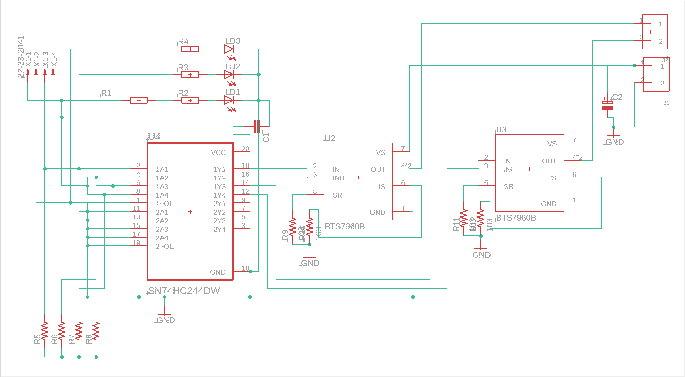
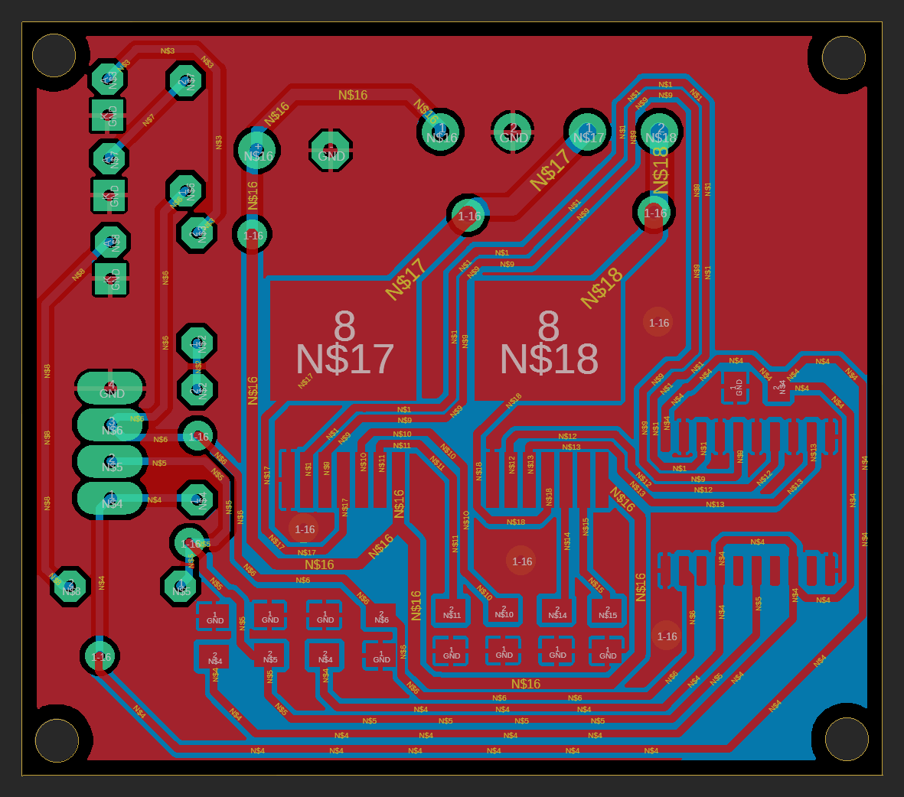
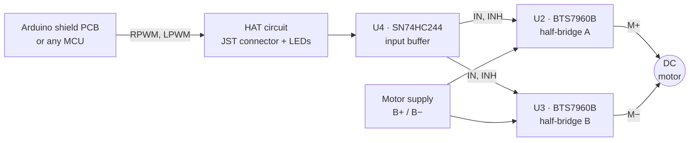

# IBT-2 High-Current H-Bridge Motor Driver (BTS7960B) — Custom PCB

<p align="center">
  
  
  
</p>

A custom-designed **IBT-2 style H-bridge motor driver** built around two Infineon **BTS7960B** high-current half-bridges and a **TI SN74HC244** input buffer. It drives one brushed DC motor in both directions, with PWM speed control from any microcontroller (Arduino, ESP32, STM32, …).

The board was designed in Autodesk EAGLE, then fabricated, assembled and bench-tested: **at full drive, the voltage across the motor terminals equals the supply voltage**, confirming that the H-bridge switches the full supply onto the load.

It also has a **built-in HAT circuit**: a red power LED, two green signal LEDs and a 4-pin JST connector that plugs straight into an Arduino shield PCB — see [Built-in HAT Circuit](#built-in-hat-circuit).

## Contents

- [Fabricated Board](#fabricated-board)
- [Schematic and PCB](#schematic-and-pcb)
- [Features](#features)
- [Built-in HAT Circuit](#built-in-hat-circuit)
- [How It Works](#how-it-works)
- [Pinout](#pinout)
- [Control Logic](#control-logic)
- [Quick Start (Arduino)](#quick-start-arduino)
- [Specifications](#specifications)
- [Test Results](#test-results)
- [Bill of Materials](#bill-of-materials)
- [Repository Structure](#repository-structure)
- [Limitations and Future Improvements](#limitations-and-future-improvements)
- [References](#references)
- [Author](#author)
- [License](#license)

---

## Fabricated Board

<!-- Put your two photos in the images/ folder with exactly these names: fabricated_1.jpg and fabricated_2.jpg -->
<p align="center">
  
  &nbsp;&nbsp;
  
</p>
<p align="center"><em>The fabricated and assembled board</em></p>

## Schematic and PCB

<p align="center">
  
</p>
<p align="center"><em>Schematic — U4 buffers the inputs, U2 + U3 form the H-bridge, J1 = power in, J2 = motor out</em></p>

<p align="center">
  
</p>
<p align="center"><em>PCB layout — 2 layers, 59.6 × 52.3 mm, red = top copper, blue = bottom copper, GND pour on both layers</em></p>

## Features

- **Full H-bridge** from two BTS7960B NovalithIC™ half-bridges (7 mΩ high-side + 9 mΩ low-side, typ.)
- **Buffered inputs** — an SN74HC244 sits between the microcontroller and the power stage
- **Only two control signals** (RPWM, LPWM) — both half-bridges are enabled automatically when logic power is present
- **Safe default state** — on-board 30 kΩ pull-downs hold RPWM/LPWM LOW if the MCU pins float (e.g. during reset), so the motor is held in brake instead of running
- **Built-in HAT circuit** — red power LED, two green signal LEDs and a 4-pin JST connector for direct connection to an Arduino shield PCB
- **Protection built into the BTS7960B** — current limitation, short-circuit and over-temperature shutdown, under-voltage shutdown, over-voltage lock-out
- **Adjustable slew rate** through the SR resistors (10 kΩ fitted)
- **Bulk capacitor** on the motor supply and a decoupling capacitor on the logic supply
- **5 mm screw terminals** for power and motor
- 4 × Ø3 mm mounting holes

## Built-in HAT Circuit

The logic side of the board is a small built-in **HAT circuit**: the driver plugs into an Arduino shield PCB with one cable, and its status can be read at a glance — no loose jumper wires.

| Part | Type | Function |
|:---:|:---|:---|
| LD1 | 🔴 Red LED, 3 mm | **Power ON** — lights when the logic supply (VCC) is present |
| R1 | Diode (on the R1 footprint) | **Reverse protection** — in series with the red power LED, protects the LED branch if VCC is connected backwards |
| LD2 | 🟢 Green LED, 3 mm | **RPWM signal** — lights when RPWM is HIGH (forward) |
| LD3 | 🟢 Green LED, 3 mm | **LPWM signal** — lights when LPWM is HIGH (reverse) |
| X1 | 4-pin JST connector | **Direct connection to the Arduino shield PCB** with a single JST cable (VCC, LPWM, RPWM, GND) |

The green LEDs are driven by the control signals themselves, so under PWM their brightness follows the duty cycle — direction and approximate speed are visible at a glance.

## How It Works



- **Power stage** — each BTS7960B contains a high-side P-MOSFET, a low-side N-MOSFET and a gate driver with built-in dead-time. With INH HIGH, `IN = HIGH` connects the output to B+ and `IN = LOW` connects it to GND; INH LOW puts the chip to sleep. U2 drives **M+**, U3 drives **M−**, and the motor sits between them.
- **Input stage** — U4 buffers RPWM → U2 `IN` and LPWM → U3 `IN`. Two more U4 channels (1A2, 1A4) are tied to VCC, so both `INH` pins go HIGH as soon as logic power is applied. The unused second half of U4 has its inputs and output-enable tied to GND so nothing floats.
- **Slew rate and current sense** — R9/R11 (10 kΩ, SR → GND) give a moderate switching slew rate. The IS (current-sense / fault) pins are terminated with R10/R12 (10 kΩ) to GND and are not routed to the header in this revision.
- **Supply** — C2 (330 µF) is the bulk capacitor on B+, C1 (100 nF) decouples U4. A diode on the R1 footprint sits in series with the power-LED branch (X1-1 → R1 → R2 → LD1). Logic ground and power ground are the same net.

## Pinout

> The **B+ B− M+ M−** labels are printed on the **bottom** silkscreen. On X1, pin 4 (GND) is next to the **GND** mark on the top silkscreen.

### X1 — JST logic connector (4-pin, to the Arduino shield)

| Pin | Signal | Description |
|:---:|:---|:---|
| 1 | **VCC** | Logic supply for U4 — 5 V (or 3.3 V for 3.3 V MCUs). Also enables both half-bridges; red LED LD1 lights. |
| 2 | **LPWM** | Drives U3 → **M−**. HIGH = M− to B+, LOW = M− to GND. Green LED: LD3 |
| 3 | **RPWM** | Drives U2 → **M+**. HIGH = M+ to B+, LOW = M+ to GND. Green LED: LD2 |
| 4 | **GND** | Ground (same net as B−) |

### J1 — Power input (2-pin screw terminal, 5 mm)

| Pin | Label | Description |
|:---:|:---:|:---|
| 1 | **B+** | Motor supply V<sub>S</sub>, 5.5 – 27.5 V |
| 2 | **B−** | Supply ground |

### J2 — Motor output (2-pin screw terminal, 5 mm)

| Pin | Label | Description |
|:---:|:---:|:---|
| 1 | **M+** | Output of U2 (controlled by RPWM) |
| 2 | **M−** | Output of U3 (controlled by LPWM) |

> **Wiring:** always connect the microcontroller GND to X1-4. B− and X1-4 are the same ground.

## Control Logic

Both half-bridges are enabled whenever VCC is present (INH = HIGH).

| RPWM (X1-3) | LPWM (X1-2) | M+ | M− | Motor |
|:---:|:---:|:---:|:---:|:---|
| HIGH | LOW | B+ | GND | Forward, full speed (V<sub>out</sub> ≈ V<sub>in</sub>) |
| LOW | HIGH | GND | B+ | Reverse, full speed |
| PWM | LOW | PWM | GND | Forward, speed ∝ duty cycle |
| LOW | PWM | GND | PWM | Reverse, speed ∝ duty cycle |
| LOW | LOW | GND | GND | Brake (both low-side switches on) — also the default when the inputs float |
| HIGH | HIGH | B+ | B+ | Brake (both high-side switches on) |

> Bring the motor to a stop (both inputs LOW) before reversing direction.

## Quick Start (Arduino)

Plug the JST cable from the Arduino shield PCB into X1, or wire the pins directly:

| Driver | Connect to |
|:---|:---|
| X1-1 VCC | Arduino **5V** |
| X1-2 LPWM | Arduino **D6** |
| X1-3 RPWM | Arduino **D5** |
| X1-4 GND | Arduino **GND** |
| J1 B+ / B− | Motor power supply + / − |
| J2 M+ / M− | DC motor |

```cpp
// IBT-2 (BTS7960B) custom driver — bidirectional test
const uint8_t RPWM = 5;   // X1-3 -> M+
const uint8_t LPWM = 6;   // X1-2 -> M-

// speed: -255 (full reverse) ... 0 (brake) ... +255 (full forward)
void setMotor(int speed) {
  speed = constrain(speed, -255, 255);
  if (speed >= 0) {
    analogWrite(LPWM, 0);
    analogWrite(RPWM, speed);
  } else {
    analogWrite(RPWM, 0);
    analogWrite(LPWM, -speed);
  }
}

void setup() {
  pinMode(RPWM, OUTPUT);
  pinMode(LPWM, OUTPUT);
  setMotor(0);
}

void loop() {
  setMotor(255);  delay(2000);   // full forward: V(M+ - M-) ≈ +V_in
  setMotor(0);    delay(1000);   // brake
  setMotor(-255); delay(2000);   // full reverse: V(M+ - M-) ≈ -V_in
  setMotor(0);    delay(1000);
  setMotor(128);  delay(2000);   // about 50 % speed forward
  setMotor(0);    delay(1000);
}
```

**Notes**

- **3.3 V boards (ESP32, STM32, Pico):** power X1-1 (VCC) from **3.3 V**, not 5 V. With VCC = 5 V the 74HC244 needs about 3.5 V for a logic HIGH, which a 3.3 V pin may not reach reliably. The BTS7960B inputs only need ≥ 2.15 V, so 3.3 V logic is enough. *(3.3 V operation follows from the datasheets; not yet tested on this board.)*
- **Never power VCC above 5.3 V** — U4 passes VCC straight to the BTS7960B `IN`/`INH` pins, whose absolute maximum is 5.3 V.
- Arduino Uno PWM on D5/D6 runs at about 980 Hz, which can make the motor whine. The BTS7960B supports PWM up to 25 kHz.

## Specifications

| Parameter | Value |
|:---|:---|
| Motor supply V<sub>S</sub> (B+) | 5.5 – 27.5 V (BTS7960B operating range; undervoltage shutdown at 4.0 – 5.4 V, over-voltage lock-out at 27.6 – 30 V) |
| Logic supply (VCC) | 5 V nominal, 3.3 V for 3.3 V MCUs — max 5.3 V |
| Control inputs | RPWM, LPWM — active HIGH, 30 kΩ pull-down on each |
| Interface (HAT circuit) | 4-pin JST connector · red power LED · 2 green signal LEDs |
| PWM frequency | Up to 25 kHz |
| Switch on-resistance | 7 mΩ high-side + 9 mΩ low-side (typ. at 25 °C) → 16 mΩ path resistance |
| IC current limit | 43 A typ. — *board current is limited by the copper, see [Limitations](#limitations-and-future-improvements)* |
| Protection | Current limitation, short-circuit, over-temperature (latched), under-/over-voltage |
| PCB | 2 layers, 59.6 × 52.3 mm, 35 µm (1 oz) copper, GND pour on top and bottom |
| Trace widths | Signals 0.51 mm · V<sub>S</sub> 0.76–0.81 mm · motor outputs 1.27 mm |
| Mounting | 4 × Ø3.0 mm holes |
| Design tool | Autodesk EAGLE 9.6.2 |

## Test Results

| Test | Condition | Result |
|:---|:---|:---|
| Output voltage at full drive | Motor supply on B+/B−, logic powered, one input HIGH and the other LOW | V<sub>M+ − M−</sub> = V<sub>in</sub> ✅ |

<!-- Add your measured numbers here, e.g. "12.0 V in -> 12.0 V out", plus the motor or load used. -->

The output matched the supply, which means the high-side switch of one BTS7960B and the low-side switch of the other are fully on. The only loss is the typical 16 mΩ path resistance (≈ 16 mV per amp of motor current).

## Bill of Materials

| Ref | Qty | Value / Part | Package | Function |
|:---|:---:|:---|:---|:---|
| U2, U3 | 2 | Infineon **BTS7960B** | P-TO-263-7 | High-current half-bridge |
| U4 | 1 | TI **SN74HC244DW** | SOIC-20 (wide) | Octal buffer, input stage |
| R9, R11 | 2 | 10 kΩ (103) | 1206 | Slew-rate resistor, SR → GND |
| R10, R12 | 2 | 10 kΩ (103) | 1206 | Current-sense load, IS → GND |
| R5, R8 | 2 | 30 kΩ (303) | 1206 | Pull-downs on RPWM / LPWM |
| R6, R7 | 2 | 30 kΩ (303) | 1206 | Pull-downs on U4 enable inputs (tied to VCC in this revision, so optional) |
| R1 | 1 | Diode (fitted on the R1 footprint) | THT, 7.62 mm pitch | Reverse-polarity protection for the power-LED branch (X1-1 → R1 → R2 → LD1) |
| R2, R3, R4 | 3 | 1 kΩ | THT 0207, 7.62 mm pitch | LED series resistors: R2 → LD1 (red), R3 → LD2 (green), R4 → LD3 (green) |
| LD1 | 1 | Red LED, 3 mm | THT | Power indicator (HAT circuit) |
| LD2, LD3 | 2 | Green LED, 3 mm | THT | RPWM / LPWM signal indicators (HAT circuit) |
| C1 | 1 | 100 nF ceramic (X7R, ≥ 16 V) | 1206 | U4 supply decoupling |
| C2 | 1 | 330 µF electrolytic | Radial, 5 mm pitch, up to Ø10 mm | Motor-supply bulk capacitor — voltage rating must be above B+ (e.g. 35 V for a 24 V supply) |
| X1 | 1 | 4-pin JST connector | 2.54 mm pitch (Molex 22-23-2041 footprint) | Logic connector to the Arduino shield (HAT circuit) |
| J1, J2 | 2 | 2-pin PCB screw terminal | 5 mm pitch | Power input / motor output |


> The BTS7960B is listed as obsolete by major distributors (e.g. DigiKey) — check availability before building one.

## Repository Structure

```
IBT2-BTS7960-Motor-Driver/
├── hardware/
│   ├── IBT2_BTS7960.sch            # EAGLE schematic
│   ├── IBT2_BTS7960.brd            # EAGLE board layout
│   └── IBT2_BTS7960.dxf            # DXF export (top copper, pads, vias, outline)
├── fabrication/
│   ├── board_print_2025-07-05.pdf  # 1:1 board print, A4
│   └── board_print_2025-07-06.pdf  # 1:1 board print, A4
├── images/
│   ├── schematic.png
│   ├── pcb_layout.png
│   ├── fabricated_1.jpg
│   └── fabricated_2.jpg
├── LICENSE
└── README.md
```

Open the `.sch` / `.brd` pair in **Autodesk EAGLE 9.x** or **Autodesk Fusion Electronics**; KiCad can also import EAGLE projects. Keep both files in the same folder with the same name so the schematic and board stay linked.

## Limitations and Future Improvements

**Current capability.** The BTS7960B itself handles tens of amps, but on this PCB the motor current flows through 0.76 mm (V<sub>S</sub>) and 1.27 mm (output) traces on 1 oz copper, with single vias where the power paths change layers. A rough IPC-2221 estimate puts the V<sub>S</sub> trace at about **2 – 2.7 A continuous** (10 – 20 °C temperature rise). Use it with small-to-medium motors and check the trace temperature before running higher currents.

**Fault reset.** Because `INH` is tied HIGH through U4, a latched over-temperature or short-circuit shutdown is cleared by power-cycling VCC (this pulls `INH` LOW).

Planned for the next revision:

- [ ] Replace the V<sub>S</sub> and output traces with wide copper pours and stitching vias; add more copper under the BTS7960B tabs, or a heatsink
- [ ] Add a 470 nF ceramic capacitor from V<sub>S</sub> to GND next to each BTS7960B (recommended in the datasheet)
- [ ] Bring R_IS / L_IS (current sense and fault flag) to the header, with R<sub>IS</sub> ≈ 1 kΩ (≈ 1 V per 8.5 A)
- [ ] Bring R_EN / L_EN to the header so the MCU can disable the bridge and reset faults
- [ ] Add reverse-polarity protection on B+
- [ ] Move the reverse-protection diode (now on the R1 footprint) in series with the whole VCC input — today it protects only the power-LED branch, because U4 takes VCC directly from X1-1 (a Schottky diode keeps the drop low)

## References

- [Infineon BTS7960 datasheet](https://www.infineon.com/dgdl/Infineon-BTS7960-DS-v01_01-en.pdf)
- [TI SN74HC244 product page and datasheet](https://www.ti.com/product/SN74HC244)

## Author

**Md. Mahin Rahman**<br>
Department of Electrical and Electronic Engineering, Islamic University of Technology (IUT), Gazipur, Bangladesh<br>
GitHub: [@thisisdibbo](https://github.com/thisisdibbo)

## License

Released under the [MIT License](LICENSE).
